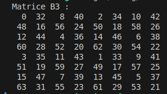

# Ditherpunk


## Partie - 1 

### Question 2 - Pour ouvrir une image depuis un fichier, on utilise … On obtient un DynamicImage, à quoi correspond ce type?


- Le type DynamicImage est une structure qui peut contenir différentes - représentations d'une image en fonction de son format (par exemple, RGB, RGBA, etc.).

- Pour obtenir une image en mode rgb8, il faut utiliser la méthode .to_rgb8() qui convertit l'image en une image avec 3 canaux (R, G, B), chacun étant un u8.

Pour utiliser le mode seuil avec une image d'entrée et une sortie spécifiée, il faut exécuter cette commande :

```rs
cargo run -- img/IUT.jpg img/IUT_OUT.png seuil
```

---

### Question 3 - Sauver l’image obtenue au format png. Que se passe-t-il si l’image de départ avait un canal alpha?

- Si l'image d'entrée a un canal "alpha", une erreur survien lors du traitement : **Error: Decoding(DecodingError { format: Exact(Png), underlying: Some(Format(FormatError { inner: InvalidSignature })) })**

- Cette erreur se déclenche à cause de ce canal "alpha" au moment d'executer la **fonction "to_rgb8()" lors du traitement**. On peut l'expliquer par le fait que cette fonction "to_rgb8()" essaie de convertir une image RGBA, en RGB8. Le RGB8 ne contenant pas de canal alpha, le format de lecture est en erreur.

---

### Question 4 - Afficher dans le terminal la couleur du pixel (32, 52) de l’image de votre choix

- Pour afficher la couleur du pixel (32, 52) d'une image. Il nous faut utiliser la fonction "get_pixel()" avec les coordonnées "32, 52".
- Il nous faut ensuite exectuter "println!("Pixel (32, 52) : {:?}", pixel);" pour afficher la couleur en RGB du Pixel.

---

### Question 5 - Passer un pixel sur deux d’une image en blanc. Est-ce que l’image obtenue est reconnaissable?

# Passer un pixel sur deux d’une image en blanc : Est-ce que l’image obtenue est reconnaissable ?

Lorsqu’on passe un pixel sur deux d’une image en blanc, l’image résultante reste souvent reconnaissable, bien que son apparence soit altérée. La perception humaine est particulièrement douée pour interpréter des motifs et reconstruire des formes même lorsqu’une partie de l’information visuelle est absente ou modifiée.

Cependant, plusieurs facteurs influencent la reconnaissance :

# Passer un pixel sur deux d’une image en blanc : Est-ce que l’image obtenue est reconnaissable ?

- Pour modifier l'image, j'ai utilisé un simple algorithme qui parcourt chaque pixel et passe un pixel sur deux en blanc (`rgb(255, 255, 255)`). Voici le code utilisé :

```rust
let mut pixelblanc = false;

for (x, y, pixel) in rgb_image.enumerate_pixels_mut() {
    if pixelblanc {
        // passer le pixel en blanc en utilisant le rgb(255, 255, 255)
        pixel.0[0] = 255;
        pixel.0[1] = 255;
        pixel.0[2] = 255;
        pixelblanc = false;
    } else {
        pixelblanc = true;
    }
}
```

- Grâce à la haute résolution de l'image utilisé, l'image obtenue reste bien reconnaissable malgré cette transformation.

---

### Question 6 - Comment récupérer la luminosité d’un pixel?

- La luminosité d’un pixel peut être estimée en appliquant une formule pondérée, qui tient compte de la sensibilité humaine aux différentes couleurs :
**Luminosité=0.299×R+0.587×G+0.114×B**
- Cette formule donne un nombre à virgule flottante représentant la luminosité.

Voici la fonction crée afin de récupérer la luminosité d'un pixel :

```rust
fn luminosity_of_pixel(pixel: Rgb<u8>) -> f32 {
    let (r, g, b) = (pixel[0], pixel[1], pixel[2]);
    0.299 * r as f32 + 0.587 * g as f32 + 0.114 * b as f32
}
```

- pixel[0], pixel[1], et pixel[2] représentent les composantes Rouge, Vert et Bleu du pixel.
- Chaque composante est convertie en f32 pour effectuer le calcul avec les coefficients pondérés.
- La valeur de la luminosité renvoyer sera :
    - Valeur minimale : 0.00.0 (luminosité d’un pixel complètement noir).
    - Valeur maximale : 255.0255.0 (luminosité d’un pixel complètement blanc).

--- 

### Question 7 - Implémenter le traitement

- Si la luminosité dépasse 50% de son maximum (127.5 sur une échelle de 0 à 255), le pixel sera remplacé par blanc → R=G=B=255R=G=B=255 → Rgb([255, 255, 255])
- Sinon, il sera remplacé par noir → R=G=B=0R=G=B=0 → Rgb([0, 0, 0])

Voici le code de la fonction crée passer une image en monochrome :

```rust
fn to_monochrome(image: &mut RgbImage) {
    for y in 0..image.height() {
        for x in 0..image.width() {
            let pixel = image.get_pixel(x, y);
            let luminosity = luminosity_of_pixel(*pixel);

            // Remplacement par blanc ou noir en fonction de la luminosité
            if luminosity > 127.5 {
                image.put_pixel(x, y, WHITE);
            } else {
                image.put_pixel(x, y, BLACK);
            }
        }
    }
}
```
- La fonction **to_monochrome** convertit une image couleur en une image monochrome (noir et blanc) en remplaçant chaque pixel par du blanc ou du noir en fonction de sa luminosité.

---

### Question 8 - Permettre à l’utilisateurice de remplacer “noir” et “blanc” par une paire de couleurs au choix

- Pour permettre à l'utilisateur ou à l'utilisatrice de remplacer le "noir" et le "blanc" par une paire de couleurs personnalisées, nous avons ajoutée deux paramètres couleurs à l'appel de la fonction.

Voici le code la fonction crée :

```rust
fn to_pair_colors(image: &mut RgbImage, color_low: Rgb<u8>, color_high: Rgb<u8>) {
    for y in 0..image.height() {
        for x in 0..image.width() {
            let pixel = image.get_pixel(x, y);
            let luminosity = luminosity_of_pixel(*pixel);

            // Remplacement par `color_high` ou `color_low` en fonction de la luminosité
            if luminosity > 127.5 {
                image.put_pixel(x, y, color_high);
            } else {
                image.put_pixel(x, y, color_low);
            }
        }
    }
}
```

- Cette fonction remplace les pixels de l'image par une paire de couleurs en fonction de la luminosité des pixels. Les utilisateurs peuvent choisir librement les couleurs pour les zones sombres et claires.

---

### Question 9 - Comment calculer la distance entre deux couleurs? Indiquer dans le README la méthode de calcul choisie

- Pourquoi choisir la distance euclidienne ?

    - Simplicité : La distance euclidienne est facile à comprendre et à implémenter.
    - Performance : Calculer cette distance est rapide et suffisant pour la plupart des applications en RGB.
    - Applications courantes : Elle est souvent utilisée dans des algorithmes de clustering (comme K-means) et dans les comparaisons simples de couleurs.

Voici la fonction crée avec le choix de la distance euclidienne :

```rust
fn color_distance(c1: Rgb<u8>, c2: Rgb<u8>) -> f32 {
    let r_diff = c1[0] as f32 - c2[0] as f32;
    let g_diff = c1[1] as f32 - c2[1] as f32;
    let b_diff = c1[2] as f32 - c2[2] as f32;

    // Calcul de la distance euclidienne
    ((r_diff.powi(2) + g_diff.powi(2) + b_diff.powi(2)).sqrt())
}
```

- La méthode utilisée pour calculer la distance entre deux couleurs est basée sur la distance euclidienne dans l'espace RGB. Voici la formule employée :
distance= √{(R_2 - R_1)^2 + (G_2 - G_1)^2 + (B_2 - B_1)^2}


Distance minimale (0) :

    La distance entre deux couleurs est 0 lorsque les couleurs sont identiques. Cela signifie que les composantes RGB de chaque couleur sont identiques, donc R1=R2R1​=R2​, G1=G2G1​=G2​, et B1=B2B1​=B2​.
    Par exemple, la distance entre rouge (255,0,0)(255,0,0) et rouge (255,0,0)(255,0,0) est 0.

Distance maximale (√(255² + 255² + 255²)) :

    La distance maximale se produit lorsque les couleurs sont complètement opposées dans l'espace RGB. Cela se produit, par exemple, lorsque l'une des couleurs est complètement noire (0,0,0)(0,0,0) et l'autre complètement blanche (255,255,255)(255,255,255), ou si les composantes de l'une des couleurs sont maximales (255) et minimales (0) dans toutes les composantes RGB.
    Pour calculer la distance maximale, on suppose que chaque composante RR, GG, et BB varie de 0 à 255. La distance maximale entre deux couleurs sera donc :

    distance maximale=(255−0)2+(255−0)2+(255−0)2
    distance maximale=2552+2552+2552=3×2552≈3×65025≈195075≈441.67

--- 

### Question 10 - Implémenter le traitement

#### 1. Définition de la palette

La palette utilisée dans ce cas est un ensemble de couleurs prédéfinies. Chaque couleur est représentée par une valeur RGB (Rouge, Vert, Bleu). Voici un exemple de palette avec 9 couleurs :

```rust
const PALETTE: [Rgb<u8>; 8] = [
    BLACK, WHITE, BLUE, RED, GREEN, YELLOW, MAGENTA, CYAN
];
```

#### 2. Calculer la distance entre un pixel et chaque couleur de la palette

    Pour déterminer quelle couleur de la palette est la plus proche d’un pixel, nous utilisons la distance euclidienne dans l’espace RGB. Nous utilisons donc la fonction **"color_distance"** précèdement crée.

#### 3. Remplacer le pixel par la couleur la plus proche dans la palette

    Chaque pixel de l’image est comparé à toutes les couleurs de la palette pour déterminer laquelle est la plus proche en termes de distance. Une fois cette couleur identifiée, elle remplace la couleur originale du pixel.

Voici les fonctions créent pour appliquer cette transformation sur une image :

```rust
fn to_palette(image: &mut RgbImage, palette: &[Rgb<u8>]) {
    for y in 0..image.height() {
        for x in 0..image.width() {
            let pixel = image.get_pixel(x, y);
            let closest_color = find_closest_color(*pixel, palette);
            image.put_pixel(x, y, closest_color);
        }
    }
}

fn find_closest_color(pixel: Rgb<u8>, palette: &[Rgb<u8>]) -> Rgb<u8> {
    let mut min_distance = f32::MAX;
    let mut closest_color = palette[0];

    for &color in palette {
        let distance = color_distance(pixel, color);
        if distance < min_distance {
            min_distance = distance;
            closest_color = color;
        }
    }

    closest_color
}
```

Lorsqu'on applique cette méthode, chaque pixel de l’image originale est remplacé par la couleur de la palette qui lui est la plus proche. Par exemple :

    Un gris clair dans l’image peut être remplacé par le GREY (127,127,127)(127,127,127).
    Une teinte bleu ciel peut être remplacée par le CYAN (0,255,255)(0,255,255).

--- 

### Question 11 - Votre application doit se comporter correctement si on donne une palette vide. Vous expliquerez dans votre README le choix que vous avez fait dans ce cas

Lorsque l'application reçoit une palette vide, elle ne modifie pas l'image et affiche un message d'information dans la console : 

    La palette est vide. Aucun traitement n'est appliqué.

Cela garantit que l'application reste stable et n'essaie pas de comparer des pixels à une palette inexistante.

---

#### Justification du choix

1. **Robustesse :** En ne modifiant rien, nous évitons des erreurs ou des comportements inattendus (comme une tentative d'accès à un élément inexistant dans la palette).
2. **Clarté pour l'utilisateur :** L'utilisateur est informé que la palette est vide grâce à un message clair.
3. **Non-destruction :** Il est préférable de ne rien faire que de produire des résultats inattendus (par exemple, remplir l'image avec une couleur par défaut).

---

### Question 12 - Implémenter le tramage aléatoire des images

#### 1. Principe du tramage aléatoire :

    Pour chaque pixel, un seuil aléatoire est généré entre 0 et 255.
    La luminosité du pixel est comparée à ce seuil :
        Si la luminosité >> seuil aléatoire, le pixel devient blanc.
        Sinon, le pixel devient noir.

#### 2. Utilisation de rand::Rng:

    Le générateur aléatoire rand::thread_rng() est utilisé pour produire un seuil différent pour chaque pixel.
    La plage [0.0,255.0][0.0,255.0] garantit que le seuil aléatoire est comparable à la luminosité calculée, qui est également dans cet intervalle.

#### 3. Luminosité d’un pixel :

    La fonction luminosity_of_pixel(pixel) (définie précédemment) calcule la luminosité pondérée selon les composantes RGB.

Avant tramage

    L'image est composée de couleurs ou de niveaux de gris.

Après tramage aléatoire

    L'image est composée uniquement de noir et de blanc, mais avec des motifs aléatoires qui ajoutent une impression de nuances.

Voici la fonction crée pour implémenter le tramage aléatoire des images :

```rust
fn random_dithering(image: &mut RgbImage) {
    let mut rng = rand::thread_rng(); // Générateur de nombres aléatoires

    for y in 0..image.height() {
        for x in 0..image.width() {
            let pixel = image.get_pixel(x, y);
            let luminosity = luminosity_of_pixel(*pixel);

            // Générer un seuil aléatoire entre 0 et 255
            let random_threshold = rng.gen_range(0.0..255.0);

            // Déterminer la nouvelle couleur en fonction de la luminosité et du seuil
            if luminosity > random_threshold {
                image.put_pixel(x, y, WHITE);
            } else {
                image.put_pixel(x, y, BLACK);
            }
        }
    }
}
```

---

### Question 13 - Déterminer 𝐵3

#### Définition de la matrice de Bayer 

    La matrice de Bayer d'ordre 0 est donnée comme :

    B0​=[0​]

    La matrice de Bayer d'ordre n+1 est obtenue par :
    Bn+1=(1/4)*[4Bn     4Bn+3Un
                4Bn+2Un 4Bn+Un]


    où Un​ est une matrice de taille 2n×2n dont tous les éléments valent 1


#### Calcul pas à pas 

La matrice B3​ peut être calculée de manière récursive à partir de B2​. 
Voici les étapes :

    B2=(1/16)*[0   8  2 10
               12  4 14  6
               3  11  1  9
               15  7 13  5]
​
U2​ est une matrice 4×4 de 1 :

    U2=[1 1 1 1
        1 1 1 1
        1 1 1 1
        1 1 1 1]

​
Calcul de 4B2,4B2+3U2,4B2+2U2,4B2+U2

Chaque élément de B2 est multiplié par 4, puis on ajoute 3,2, ou 1 selon le cas pour les blocs.

    4B2 : ​

    4B2=[0  32  8 40
         48 16 56 24
         12 44  4 36
         60 28 52 20]

    4B2+3U2 :

    4B2+3U2=[3  35 11 43
             51 19 59 27
             15 47  7 39
             63 31 55 23]

    4B2+2U2 :

    4B2+2U2=[2  34 10 42
             50 18 58 26
             14 46  6 38
             62 30 54 22]

    4B2+1U2 :

    4B2+U2=[1  33  9 41
            49 17 57 25
            13 45 5  37
            61 29 53 21]

Assemblage de B3

On assemble les blocs pour obtenir B3​ :

    B3=(1/64)*[4B2      4B2+3U2
               4B2+2U2  4B2+U2]

Ce qui donne directement :

    B3=[0  32  8 40  2 34 10 42 
        48 16 56 24 50 18 58 26 
        12 44  4 36 14 46  6 38 
        60 28 52 20 62 30 54 22 
         3 35 11 43  1 33  9 41
        51 19 59 27 49 17 57 25
        15 47  7 39 13 45  5 37
        63 31 55 23 61 29 53 21]

--- 

Nous avons pu créée la fonction generate_bayer_matrix génère récursivement une matrice de Bayer d'ordre nn, utilisée pour le "ordered dithering".

Elle commence avec une matrice de base B0=[[0]]. À chaque ordre supérieur, la matrice est agrandie en divisant l'espace en 4 quadrants, chacun calculé selon la formule donnée :

    4×Bn4×Bn​
    4×Bn+2×Un
    4×Bn+3×Un
    4×Bn+Un

où Un​ est une matrice remplie de 1.

La fonction combine ces quadrants dans une nouvelle matrice de taille 2n×2n, en suivant une approche récursive. Cela permet de construire des matrices d'ordre arbitraire de manière efficace, tout en respectant la définition mathématique.



---

### Question 14 - Quel type de données utiliser pour représenter la matrice de Bayer? Comment créer une matrice de Bayer d’ordre arbitraire?

Pour représenter la matrice de Bayer, un tableau 2D (comme un vecteur de vecteurs de 32bits en Rust) est adapté. Voici pourquoi :

    Structure simple : La matrice est carrée (2n×2n) et ses éléments sont des entiers.
    Facilité d'accès : Un tableau 2D permet un accès direct à M[i][j]

Pour générer une matrice d'ordre arbitraire, une fonction récursive est idéale. Voici l'algorithme :

    Cas de base : B0=[[0]]
    Construction :
        Calculer 4Bn​, 4Bn+3, 4Bn+2, 4Bn+1.
        Assembler les blocs dans une nouvelle matrice

---

### Question 15 - Implémenter le tramage par matrice de Bayer

​